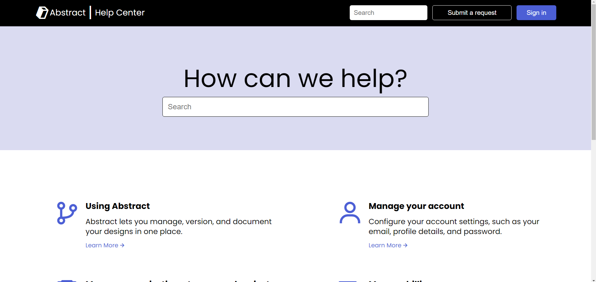

# Frontend Practice: Abstract

## Overview

This repository contains a practice page created for Frontend Practice. Creating replicas of actual websites from existing companies.

Come and check [here](https://krig6.github.io/fend-practice-abstract/)!

## Sample

## Technologies Used

- HTML: Provides the structure and layout of the web page.
- CSS: Styles the overall design of the page.

## Learning Path

Creating this page from scratch was an enjoyable experience. It's a valuable exercise for honing CSS skills through practical website building, enhancing overall frontend knowledge.

## Future Enhancements

- Responsive design for all devices

## Acknowledgments

- [Frontend Practice](https://www.frontendpractice.com/)
- [Abstract](https://www.abstract.com/)
